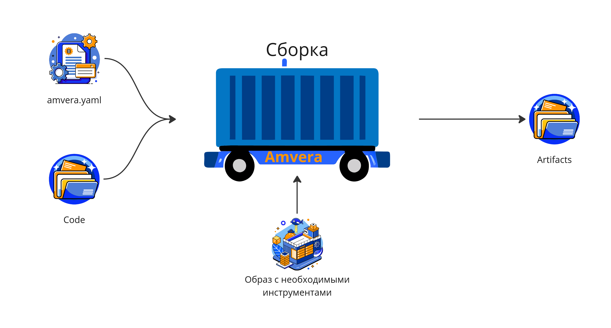
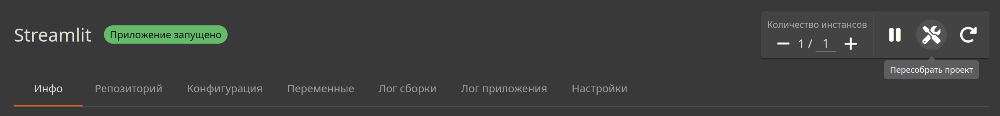
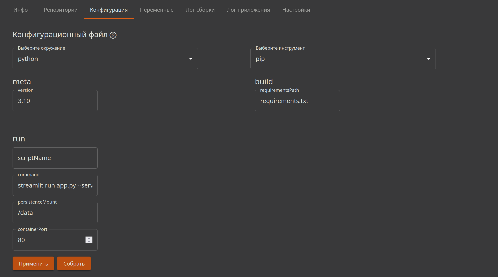
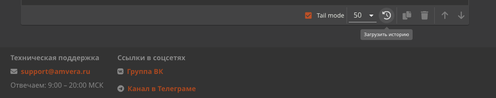

# Сборка¶

## Содержание

- Сборка
- Процесс сборки сamvera.yaml
- Инициализация сборки
  - Автоматическая сборка
  - Ручная сборка
- Лог сборки

---

Back to top

[ View this page ](<../_sources/applications/build.md.txt> "View this page")

Toggle Light / Dark / Auto color theme

Toggle table of contents sidebar

__

# Сборка

Получив команду на сборку, облако Amvera ищет в папке Code [конфигурационный файл](configuration/config-file.md) ``amvera.yaml``. Возможны три ситуации:
1. **Отсутствует``amvera.yaml``, но удается найти ``Dockerfile``.**
* Начинается сборка образа, используя ``Dockerfile``. Процесс описан в [этом разделе](configuration/docker.md).
2. **Отсутствует и``amvera.yaml`` и ``Dockerfile``.**
* Сборка завершается ошибкой.
3. **Присутствует``amvera.yaml``.**
* Начинается сборка приложения.

## Процесс сборки с ``amvera.yaml``

 Облако Amvera считывает раздел ``meta`` из файла конфигурации amvera.yaml и ищет подходящий инструмент для сборки в [списке поддерживаемых окружений](supported-env.md). Под инструментом для сборки подразумевается готовый образ с установленным в него компилятором/интерпретатором, который используется для создания контейнера сборки. При создании контейнера в него через ``git clone`` попадает содержимое папки ``code``.

> **⚠️ Предупреждение** > > Важно Так как для клонирования сожержимого используется команда git clone, то файлы и папки, указанные в .gitignore не попадут в стадию сборки. 

Во время работы контейнера происходит запуск инструмента сборки для выбранного окружения с указанными в секции ``build`` параметрами. Запуск команды выполняется в [склонированной папке ``code``](storage.md#code) после чего файлы, необходимые для работы приложения, архивируются и сохраняются в хранилище.

В процессе сборки статус приложения будет «Выполняется сборка». В случае, если сборка выполнилась успешно, статус сменится на «Проект развертывается» и облако Amvera автоматически инициализирует процесс запуска приложения.

Если сборка завершилась с ошибкой, то следует обратиться к логам сборки.

> **⚠️ Предупреждение** > > Важно Сборка приложения осуществляется в дополнительном контейнере, тарифицирующемся так же, как и само приложение, из-за чего текущее количество работающих инстансов может быть больше требуемого. 

## Инициализация сборки

> **⚠️ Предупреждение** > > Важно Во время сборки уже запущенные реплики приложения продолжают работать, что обеспечивает накатывание обновлений с минимальным DOS. 

### Автоматическая сборка

Сборка начинается автоматически, если был совершен пуш в ``master`` ветку [git репозитория](git.md) Амвера. Так-же сборка приложения автоматически начинается после завершения процесса создания приложения в том случае, если была выбрана опция загрузки файлов через интерфейс.

### Ручная сборка

В том случае, если требуется вручную инициализировать процесс сборки приложения это можно сделать двумя способами:
1. Если приложение ранее собиралось, то будет доступна кнопка «Пересобрать проект» в панели инструментов на странице приложения 
2. Если проект ранее не собирался или указанная выше кнопка по какой-либо причине не активна можно перейти в раздел «Конфигурация». В этом разделе при наличии заполненной [конфигурации](configuration/config-file.md) внизу будет доступна кнопка «Собрать». 

## Лог сборки

Для отслеживания процесса сборки следует воспользоваться консолью вывода логов, которая находится во вкладке «Лог сборки». Загрузка логов может занимать некоторое время и работать с задержкой.

Для загрузки логов необходимо нажать на кнопку «Загрузить историю», которая расположена в нижнем правом углу окна логов и выглядит как циферблат.

> **⚠️ Предупреждение** > > Важно Если процесс сборки завершился с ошибкой, и лог остается пустым при нескольких попытках его загрузить, следует проверить правильность заполнения секции build конфигурационного файла. 

[ Next Запуск ](run.md) [ Previous Хранилище и пути ](storage.md)

Copyright © 2024, Amvera 

Made with [Sphinx](<https://www.sphinx-doc.org/>) and [@pradyunsg](<https://pradyunsg.me>)'s [Furo](<https://github.com/pradyunsg/furo>)

---

### Навигация

← [Хранилище и пути](storage.md)

→ [Запуск](run.md)
