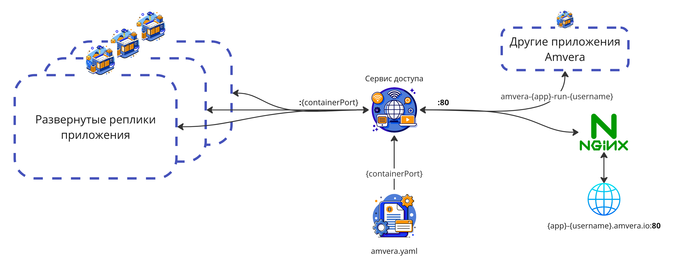
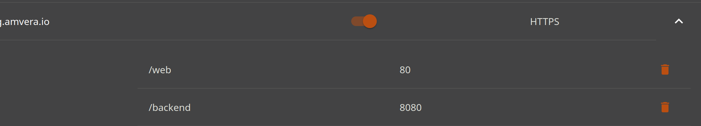
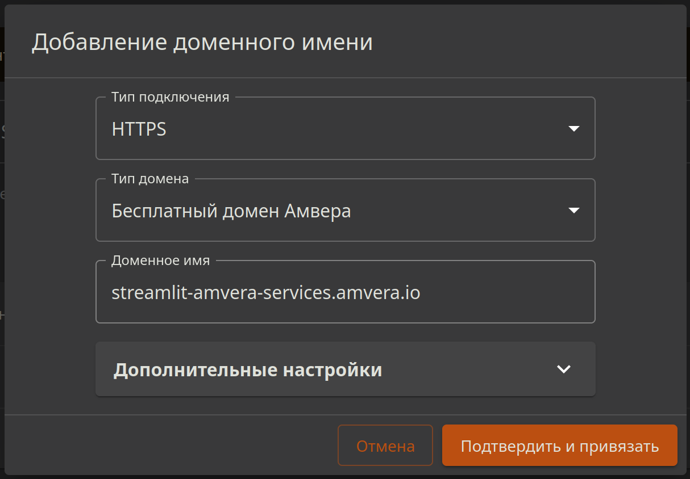
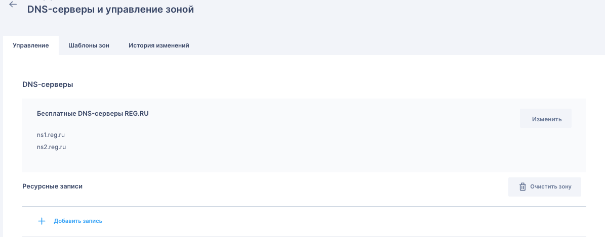

# Сетевое взаимодействие¶

## Содержание

- Сетевое взаимодействие
- Доступ из других приложений
- Доступ из сети Интернет
  - HTTP|HTTPS на базе nginx
    - Бесплатное доменное имя Амвера
    - Свое доменное имя
  - TCP трафик
- Пример настройки записей в ЛКreg.ru
- Профилактика ошибок

---

Back to top

[ View this page ](<../../_sources/applications/configuration/network.md.txt> "View this page")

Toggle Light / Dark / Auto color theme

Toggle table of contents sidebar

__

# Сетевое взаимодействие

Для каждого приложения создается _Сервис доступа_ , с помощью которого к данному приложению можно подключиться из других приложений Амвера и сети интернет. Сервис доступа транслирует указанные через запятую порты приложения в разделе ``run`` ``containerPort`` [файла конфигурации](config-file.md) в порты доступа, указываемые так-же через запятую в переменной ``servicePort`` (по умолчанию для приложений значения ``servicePort`` и ``containerPort`` равны 80). Сервис обеспечивает балансировку запросов в случае, если запущено несколько реплик одного приложения.

> **HINT** > > Подсказка Чтобы не прописывать явно номер порта, можно использовать переменную окружения PORT. По умолчанию ее значение равно 80. 



## Доступ из других приложений

Для доступа к приложению из других приложений, развернутый в Амвера достаточно обратиться к приложению по внутреннему доменному имени ``amvera-<транслитерированное-имя-проекта>-run-<имя-пользователя>``.

Для управления портами необходимо использовать параметры ``run.containerPort`` и ``run.servicePort`` [файла конфигурации](config-file.md) по умолчанию для приложений, их значения равны 80.

Так, если Ваше приложения слушает порт 8090, и требуется подключаться к нему по порту 90, секция ``run`` будет следующая:
[code] 
    ```
    run:
      --- Some other parameters ---
      containerPort: 8090
      servicePort: 90
    
    ```
    
[/code]

> **ATTENTION** > > Внимание Взаимодействие по внутренней сети происходит без шифрования со стороны Amvera! 

## Доступ из сети Интернет

Для внешнего доступа к приложениям используется два типа контроллера:
* HTTP|HTTPS на базе nginx.
* TCP с открытыми портами 5432, 27017 и 6379.

Для их активации требуется перейти в раздел «Настройки».

### HTTP|HTTPS на базе nginx

При добавлении доменного имени создается _Входной контроллер_ , который слушает указанный домен и ``80`` порт и пересылает запросы в сервис доступа, который в свою очередь доставляет их в одну из запущенных реплик приложения. При выборе типа подключения ``HTTPS`` к домену привязывается сертификат, обеспечивающий доступ по протоколу ``HTTPS``.

> **⚠️ Предупреждение** > > Важно Создание Входного контроллера и выдача SSL сертификата может занимать какое-то время. 

К одному входному контроллеру данного типа на разные пути можно посадить разные порты приложения. Если требуется, чтобы ``<domain>.amvera.io/web`` указывал на 80 порт, а ``<domain>.amvera.io/backend`` на 8080 настройки будут такими:



#### Бесплатное доменное имя Амвера

Для каждого приложения есть возможность привязать бесплатное доменное имя третьего уровня, которое обеспечит защищенный доступ к приложению из глобальной сети Интернет. Для этого в разделе «Настройки» в секции «Доменные имена» необходимо нажать на кнопку «Добавить доменное имя», выбрать тип подключения и «Тип домена»: «Бесплатный домен Амвера».

Приложение получит URL в формате ``<транслитерированное-имя-проекта>.<имя-пользователя>.amvera.io``. Так, для проекта «Тест» пользователя «user» обратиться к приложению можно по адресу ``https://test.user.amvera.io/``.



#### Свое доменное имя

Для привязки своего доменного имени, купленного у регистратора (например [reg.ru](<https://reg.ru>)) требуется выполнить следующие действия:
1. Зайти в ЛК регистратора.
* Найти «DNS-серверы и управление зоной» или подобное название. А именно там, где прописываются ``A`` запись, ``TXT``, ``@`` и т.д. в личном кабинете регистратора.
* Найти A запись, и прописать туда IP, указанный в разделе «Настройки» «Создать доменное имя» требуемого приложения в Amvera Cloud.
* Найти TXT запись, и прописать туда TXT, указанный в разделе «Настройки» «Создать доменное имя» требуемого приложения в Amvera Cloud.
2. Подождать, пока запись распространится по DNS серверам (может занимать до 24 часов).
3. В разделе «Настройки» «Создать доменное имя» указать доменное имя и нажать «Подтвердить и привязать». В случае, если все сделано верно и информация о домене дошла до DNS сервера google (8.8.8.8) домен успешно привяжется.
4. Подождать, пока сконфигурируется _Входной контроллер_ и сгенерируется бесплатный [Let’s Encrypt](<https://letsencrypt.org/>) ``SSL`` сертификат.

### TCP трафик

При выборе типа подключения ``POSTGRES``, ``MONGO`` или ``REDIS`` создается контроллер, который слушает соответствующие порты и перенаправляет TCP трафик на сервис доступа основываясь на ``SNI``.
* ``POSTGRES`` -> 5432 (подходит только для managed postgres)
* ``MONGO`` -> 27017
* ``REDIS`` -> 6379

Если нужно, чтобы приложение получало TCP трафик можно выбрать, например, тип подключения ``MONGO`` и указать ``run.servicePort`` равным 27017.

Доменное имя для TCP трафика отличается от HTTP(S) и имеет вид: ``<транслитерированное-имя-проекта>.<имя-пользователя>.db-<region>.amvera.tech``.

## Пример настройки записей в ЛК [reg.ru](<https://reg.ru>)

 Нужно нажать «Добавить запись» внизу страницы и ввести значения A и TXT.

## Профилактика ошибок

В случае, если при нажатии кнопки «Подтвердить и привязать» вылезает ошибка, следует проверить правильность заполнения записей и их наличие на DNS серверах. Для проверки записей можно воспользоваться [специальным сервисом](<https://mxtoolbox.com/txtlookup.aspx>).

Введя в поле доменное имя и нажав ``TXT Lookup`` в списке должна появится строчка с записью, требуемой к заполнению в разделе «Настройки» «Создать доменное имя». Сменив ``TXT Lookup`` на ``DNS Lookup`` должен вывестись ipv4 адрес сервера Amvera, указанный в разделе «Настройки» «Создать доменное имя».

[ Next PostgreSQL ](../../databases/postgreSQL.md) [ Previous Переменные и секреты ](variables.md)

Copyright © 2024, Amvera 

Made with [Sphinx](<https://www.sphinx-doc.org/>) and [@pradyunsg](<https://pradyunsg.me>)'s [Furo](<https://github.com/pradyunsg/furo>)


---

### Навигация

← [Переменные и секреты](variables.md)

→ [PostgreSQL](databases/postgreSQL.md)
