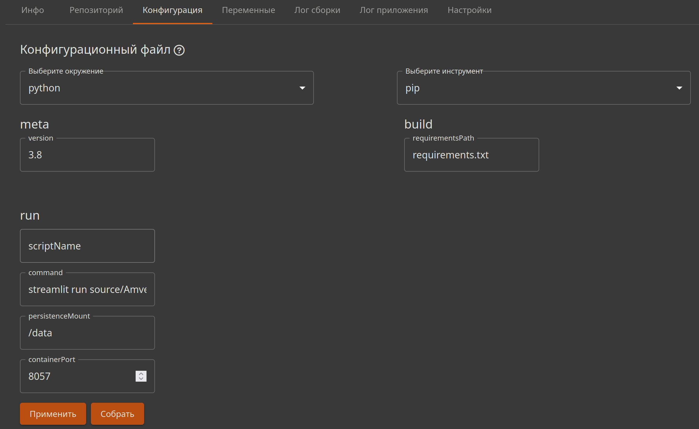

# Python Pip¶

## Содержание

- Python Pip
- Конфигурационный файл
  - Секция meta
  - Секция build
  - Секция run
  - Рецепты
    - Минимальный файл amvera.yml
    - WSGI-приложение (напр., приложение на Flask)
    - ASGI-приложение (напр., приложение на FastAPI)
- Форма графического интерфейса
  - Секция meta
  - Секция build
  - Секция run
    - scriptName
    - command
    - persistenceMount
    - conteinerPort
  - Применение конфигурации
- requirements.txt - файл с зависимостями

---

Back to top

[ View this page ](<../../_sources/applications/environments/python-pip.md.txt> "View this page")

Toggle Light / Dark / Auto color theme

Toggle table of contents sidebar

__

# Python Pip

Данная конфигурация подходит, если проект написан на языке Python и либо не имеет зависимостей, либо они прописаны в файле ``requirements.txt``.

Создать yml-файл можно в интерфейсе, воспользоваться нашим генератором yaml, перейдя по [ссылке](<https://manifest.amvera.ru/>), либо самостоятельно, используя инструкции ниже.

Инструкция по заполнению конфигурации через интерфейс находится во второй половине данной статьи.

## Конфигурационный файл

### Секция meta

В секции мета задается версия Python, которую вы используете.

Секция meta файла amvera.yml будет выглядеть следующим образом:
[code] 
    ```
    meta:
      environment: python
      toolchain:
        name: pip
        version: 3.10
    
    ```
    
[/code]

Как для сборки, так и для запуска используется образ Docker ``python:${meta.toolchain.version}``. Параметр ``meta.toolchain.version`` необязательный. Если его не указать, будет использоваться образ ``python:3``.

Так как значение параметра ``meta.toolchain.version`` является тегом образа python, можно в качестве его значения использовать произвольный тег на [докер-хабе](<https://hub.docker.com/_/python/tags>). Однако из-за того, что мы вызываем интерпретатор как ``python3``, а также пользуемся модулем ``venv`` в команде ``python3 -m venv``, образ Python должен поддерживать эти возможности.

### Секция build

В секции build указывается имя файла с зависимостями (библиотеками, которые система должна установить через pip).

В секции ``build`` может быть указан один необязательный параметр: ``requirementsPath``. Он определяет путь до файла ``requirements.txt`` относительно корня репозитория. Если этот параметр не задан, он по умолчанию равен ``requirements.txt``.

Если, например, этот файл находится в папке build, то значение этого параметра необходимо указать следующим образом:
[code] 
    ```
    build:
      requirementsPath: build/requirements.txt
    
    ```
    
[/code]

> **⚠️ Предупреждение** > > Важно Убедитесь, что ваш requirements.txt или иные необходимые для сборки файлы не оказались в .gitignore. 

Если в проекте вообще не используется файл ``requirements.txt`` или скрипт сборки не сможет его обнаружить по указанному пути, то фаза установки зависимостей будет пропущена.

### Секция run

В секции ``run`` могут быть указаны следующие параметры:
* ``scriptName``
* ``command``
* ``persistenceMount``
* ``containerPort``

Параметры ``scriptName`` и ``command`` взаимоисключающие. Один из них должен быть указан для успешного запуска приложения.

Параметр ``scriptName`` указывает путь до файла с расширением ``py``. Он используется в команде ``python3 ${run.scriptName}``:
[code] 
    ```
    run:
      scriptName: app.py
    
    ```
    
[/code]

В случае, если запуск осуществляется другой командой, например, ``gunicorn``, то можно использовать параметр ``command``:
[code] 
    ```
    run:
      command: gunicorn --bind 0.0.0.0:80 app:app
    
    ```
    
[/code]

Параметр ``persistenceMount`` позволяет указать, в какую директорию будет примонтирована папка с [постоянным хранилищем](../storage.md#data). По умолчанию имеет значение ``/data``.

Постоянное хранилище и папка data в репозитории, это разные директории. Рекомендуется использовать именно постоянное хранилище.

Параметр ``containerPort`` позволяет указать какой порт слушает приложение. По умолчанию имеет значение ``80``.

### Рецепты

#### Минимальный файл amvera.yml
[code] 
    ```
    meta:
      environment: python
      toolchain:
        name: pip
        version: 3.10
    
    run:
      scriptName: app.py
    
    ```
    
[/code]

#### WSGI-приложение (напр., приложение на Flask)

Данный файл предполагает, что ``gunicorn`` прописан в файле ``requirements.txt``.
[code] 
    ```
    meta:
      environment: python
      toolchain:
        name: pip
        version: 3.10
    
    run:
      command: gunicorn --bind 0.0.0.0:5000 app:app
      containerPort: 5000
    
    ```
    
[/code]

#### ASGI-приложение (напр., приложение на FastAPI)

Данный файл предполагает, что ``uvicorn[standard]`` прописан в файле ``requirements.txt``.
[code] 
    ```
    meta:
      environment: python
      toolchain:
        name: pip
        version: 3.10
    
    run:
      command: uvicorn --host 0.0.0.0 --port 5000 app:app
      containerPort: 5000
    
    ```
    
[/code]

## Форма графического интерфейса

Задать конфигурацию вы можете в интерфейсе личного кабинета при создании приложения, либо в разделе «Конфигурация» в созданном приложении.



### Секция meta

В данной секции доступно только указание версии python, которую требуется использовать.

### Секция build

В данной секции возможно указать имя файла с зависимостями. Чаще всего это requirements.txt. Если файл находится не в корне, то следует указать название, включающее относительный путь до него.

В файле зависимостей указываются библиотеки, которые использует приложение (устанавливалось на компьютер через pip, когда запускался проект локально). Указывать стандартные библиотеки не нужно. Частой ошибкой является использование в файле requirements.txt - имени telebot, а не pyTelegramBotAPI для телеграм-ботов на Python, правильно - pyTelegramBotAPI.

Если, например, файл с зависимостями находится не в корне, а в папке (в примере ниже в папке в build), то в значение этого поля необходимо указать:
[code] 
    ```
    build/requirements.txt
    
    ```
    
[/code]

Если файл находится в корне:
[code] 
    ```
    requirements.txt
    
    ```
    
[/code]

### Секция run

Параметры ``scriptName`` и ``command`` взаимоисключающие. Один из них должен быть указан для успешного запуска приложения.

#### scriptName

В данном поле указывается имя файла, который содержит точку входа в программу (функцию main). Так, в случае если проект состоит из одного файла с названием ``myApp.py`` достаточно в это поле вписать:
[code] 
    ```
    myApp.py
    
    ```
    
[/code]

#### command

Если проект запускается командой, укажите вместо scriptName требуемую команду запуска.

Примером может являться команда из статьи “Быстрый старт”
[code] 
    ```
    gunicorn --bind 0.0.0.0:5000 app:app
    
    ```
    
[/code]

Либо в зависимости от порта
[code] 
    ```
    command: gunicorn --bind 0.0.0.0:80 app:app
    
    ```
    
[/code]

Заполняется либо scriptName, либо command.

#### persistenceMount

Это папка постоянного хранилища. В нашем сервисе она по умолчанию /data

> **⚠️ Предупреждение** > > Важно Файлы в /data не затираются при пересборке проекта, в отличие от репозитория, где они откатятся к версии коммита. Поэтому, мы рекомендуем использовать именно /data для баз данных и других получаемых в процессе работы приложения файлов. 

Частая ошибка

Если вы создадите в репозитории папку data, это не то-же самое, что папка /data у нас. Папка data в репозитории, это просто папка в репозитории, которая может быть затерта при пересборке проекта.

В коде проекта следует указать /data как место для сохранения файлов.

Если вам неудобно использовать каталог /data, обычно, вы можете его изменить в файле amvera.yml. Например:

persistenceMount: /var/myapp/data

Задание значение persistenceMount равной /app или его подпапке может приводить к некорректному поведению.

#### conteinerPort

Указывается порт, который слушает приложение. По умолчанию это 80 порт.

Если ваше приложение работает по протоколу HTTP, но использует номер порта, отличный от 80, требуется указать номер этого порта в данное поле. Например, если приложение слушает порт 3000, то в поле вписывается значение:
[code] 
    ```
    3000
    
    ```
    
[/code]

### Применение конфигурации

> **⚠️ Предупреждение** > > Важно После заполнения соответствующих полей нажмите кнопки «применить» (для раздела «Конфигурация») или «завершить», если вы задаете параметры при создании проекта. 

Конфигурационный файл будет добавлен в корень репозитория и отобразится в папке «Code» раздела «Репозиторий». Не забудьте добавить его в свой локальный репозиторий, склонировав репозиторий из Amvera, либо скачав папку из личного кабинета.

После нажатия кнопки «Собрать» в конфигурации, либо пуше в репозиторий, либо при нажатии кнопки «Завершить» в рамках создания приложения начнется процесс [сборки](../build.md).

## requirements.txt - файл с зависимостями

Мы рекомендуем составить файл requirements.txt вручную, указав только нужные зависимости с конкретной версией. Но вы можете воспользоваться командой pip freeze, которая создаст нужный файл автоматически, при этом могут быть добавлены лишние зависимости (что замедлит сборку) и зависимости с конфликтами версий.

Чтобы получить список пакетов, выполните команду в терминале
[code] 
    ```
    pip freeze
    
    ```
    
[/code]

Для записи вывода в requirements.txt дополняем команду следующим образом:
[code] 
    ```
    pip freeze > requirements.txt
    
    ```
    
[/code]

Команду выполняем в корне проекта. Там же появится и файл. Подразумевается использование активного venv (его загружать к нам не нужно) для текущего проекта. При выполнении вне виртуальной среды текущего проекта могут быть подтянуты лишние пакеты, не связанные с текущим проектом.

Готовый requirements.txt называется requirements.txt и имеет следующую структуру
[code] 
    ```
    Имя Библиотеки==Номер Версии
    Имя Второй Библиотеки==Номер Версии
    
    ```
    
[/code]

Пример
[code] 
    ```
    Flask==2.2.2
    Flask-CORS==3.0.10
    gunicorn==20.1.0
    
    ```
    
[/code]

Добавьте полученный файл в корень репозитория (или по пути, который вы указали в amvera.yaml).

> **HINT** > > Подсказка Не нужно прописывать уже встроенные в Python библиотеки, такие как SQLite. 

> **HINT** > > Подсказка В файле прописываются те библиотеки, которые вы локально устанавливали через pip install. 

[ Next JVM Gradle ](jvm-gradle.md) [ Previous Поддерживаемые окружения ](../supported-env.md)

Copyright © 2024, Amvera 

Made with [Sphinx](<https://www.sphinx-doc.org/>) and [@pradyunsg](<https://pradyunsg.me>)'s [Furo](<https://github.com/pradyunsg/furo>)


---

### Навигация

← [Поддерживаемые окружения](supported-env.md)

→ [JVM Gradle](jvm-gradle.md)
