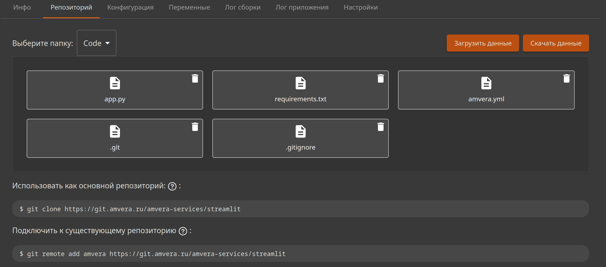

# Использование Amvera как основной репозиторий¶

## Содержание

- Использование Amvera как основной репозиторий
- Подключение репозитория
- Заполнение репозитория
- Развертывание проекта
  - Если вы столкнулись с ошибкой или вам что-то непонятно

---

Back to top

[ View this page ](<../../_sources/applications/git/main-origin.md.txt> "View this page")

Toggle Light / Dark / Auto color theme

Toggle table of contents sidebar

__

# Использование Amvera как основной репозиторий

Если вы начинаете разработку своего приложения и хотите использовать Amvera для хостинга, вы можете использовать выделенный нами репозиторий git как основной.

> **HINT** > > Подсказка Для ознакомления с принципом работы с git рекомендуем эту статью, которая упростит работу с нашим сервисом. 

## Подключение репозитория

Адрес удаленного репозитория находится на странице «Репозиторий» приложения.



Чтобы склонировать пустой репозиторий:
[code] 
    ```
    git clone https://git.amvera.ru/<имя-пользователя>/<транслитерированное-имя-проекта>
    
    ```
    
[/code]

Чтобы подключить удаленный репозиторий Амвера к локальному репозиторию:
[code] 
    ```
    git remote add origin https://git.amvera.ru/<имя-пользователя>/<транслитерированное-имя-проекта>
    
    ```
    
[/code]

## Заполнение репозитория

Напишите код вашего приложения. Чтобы его можно было собрать и запустить, необходимо наличие [файла конфигурации amvera.yaml](../configuration/config-file.md) и/или [Dockerfile](../configuration/docker.md). Советуем также ознакомиться с процессом [сборки](../build.md) и [развертывания](../run.md) приложения.

## Развертывание проекта

Для инициализации процесса сборки и развертывания приложения достаточно отправить изменения в репозиторий Амвера:
[code] 
    ```
    git push -u origin master
    
    ```
    
[/code]

На запрос пользователя и пароля укажите имя пользователя и пароль вашей учетной записи Amvera.

> **HINT** > > Подсказка Запущенные инстансы вашего проекта при ошибке сборки не останавливаются и продолжат работать. 

### Если вы столкнулись с ошибкой или вам что-то непонятно
* Ознакомьтесь с разделом [Частые ошибки](freq-errors.md) при работе с Git

[ Next Подключение к существующему репозиторию ](secondary-origin.md) [ Previous Git ](../git.md)

Copyright © 2024, Amvera 

Made with [Sphinx](<https://www.sphinx-doc.org/>) and [@pradyunsg](<https://pradyunsg.me>)'s [Furo](<https://github.com/pradyunsg/furo>)


---

### Навигация

← [Git](git.md)

→ [Подключение к существующему репозиторию](secondary-origin.md)
