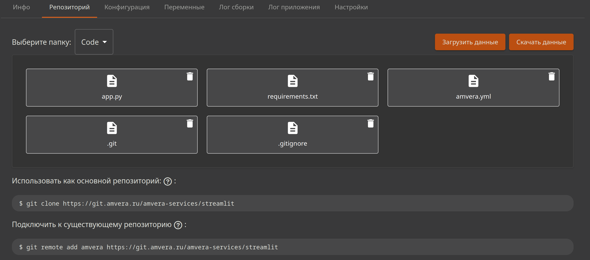

# Подключение к существующему репозиторию¶

## Содержание

- Подключение к существующему репозиторию
- Подключение репозитория
- Заполнение репозитория
- Развертывание проекта
- Пример
- Возможные ошибки
  - Если вы столкнулись с ошибкой или вам что-то непонятно

---

Back to top

[ View this page ](<../../_sources/applications/git/secondary-origin.md.txt> "View this page")

Toggle Light / Dark / Auto color theme

Toggle table of contents sidebar

__

# Подключение к существующему репозиторию

Если у вас уже есть приложение, которое вы хотите развернуть в Amvera, но оно уже использует другой репозиторий git (GitHub, Bitbucket или что-то другое), можно привязать дополнительный remote к вашему репозиторию.

> **HINT** > > Подсказка Для ознакомления с принципом работы с git рекомендуем эту статью, которая упроcтит работу с нашим сервисом. 

Адрес удаленного репозитория находится на странице «Репозиторий» приложения.



## Подключение репозитория

Откройте командную строку и перейдите в корневую папку проекта вашего приложения. Выполните команду:
[code] 
    ```
    git remote add amvera https://git.amvera.ru/<имя-пользователя>/<транслитерированное-имя-проекта>
    
    ```
    
[/code]

## Заполнение репозитория

Чтобы код можно было собрать и запустить, необходимо наличие [файла конфигурации amvera.yaml](../configuration/config-file.md) и/или [Dockerfile](../configuration/docker.md). Советуем также ознакомиться с процессом [сборки](../build.md) и [развертывания](../run.md) приложения.

## Развертывание проекта

Для инициализации процесса сборки и развертывания приложения достаточно отправить изменения в репозиторий Амвера.
[code] 
    ```
    git push amvera master
    
    ```
    
[/code]

На запрос пользователя и пароля укажите имя пользователя и пароль вашей учетной записи Amvera.

> **HINT** > > Подсказка Запущенные инстансы вашего проекта при ошибке сборки не останавливаются и продолжат работать. 

## Пример
1. Вызываем терминал в IDE, где открыто приложение, или открываем папку проекта в терминале.
2. Инициализируем локальный гит репозиторий командой (если он не инициализирован)
[code] ```
         git init
         
         ```
         
[/code]
3. Добавим удаленный репозиторий нашего проекта (url вашего репозитория будет отличаться. Во избежание синтаксических ошибок скопируйте ссылку на втором шаге создания проекта)
[code] ```
         git remote add amvera https://git.amvera.ru/Ваш_Ник/Имя_проекта
         
         ```
         
[/code]

> **⚠️ Предупреждение** > > Важно Если вы задавали конфигурацию в интерфейсе, не забудьте сделать git pull (git pull amvera master) для синхронизации репозиториев. Если вы не хотите синхронизировать репозитории, то создайте yaml по ссылке, добавьте его в корень репозитория перед певым push. При этом не добавляйте/задавайте конфигурацию в интерфейсе. Задание конфигурации и добавление файлов в интерфейсе создает коммит, после которого нужно синхронизировать репозитории при работе через git. 
4. Добавим файлы и сделаем первый коммит.
[code] ```
         git add .
         git commit -m "initial commit"
         
         ```
         
[/code]
5. Запушим наш код в репозиторий проекта
[code] ```
         git push amvera master
         
         ```
         
[/code]
6. Когда вы хотите сделать обновление проекта (вы обновили код/конфигурацию/зависимости), выполните команды:
[code] ```
         git add .
         git commit -m "Описание сделанных изменений"
         git push amvera master
         
         ```
         
[/code]

## Возможные ошибки

Если основная ветка называется не ``master``, а, например, ``main``, при выполнении команды ``git push amvera master`` появится ошибка.

Для избежания ошибки достаточно указать, из какой ветки необходимо запушить изменения:
[code] 
    ```
    git push amvera имя_основной_ветки:master
    
    ```
    
[/code]

Так, например, если основная ветка называется ``main``, команда будет выглядеть следующим образом:
[code] 
    ```
    git push amvera main:master
    
    ```
    
[/code]

Чтобы узнать, какое название имеет основная ветка (в предположении, что вы на ней находитесь):
[code] 
    ```
    git branch --show-current
    
    ```
    
[/code]

> **HINT** > > Примечание Другие частые ошибки по работе с Git собраны по ссылке 

### Если вы столкнулись с ошибкой или вам что-то непонятно
* Ознакомьтесь с разделом [Частые ошибки](freq-errors.md) при работе с Git

[ Next Подключить GitHub, GitLab, Bitbucket ](webhooks.md) [ Previous Использование Amvera как основной репозиторий ](main-origin.md)

Copyright © 2024, Amvera 

Made with [Sphinx](<https://www.sphinx-doc.org/>) and [@pradyunsg](<https://pradyunsg.me>)'s [Furo](<https://github.com/pradyunsg/furo>)


---

### Навигация

← [Использование Amvera как основной репозиторий](main-origin.md)

→ [Подключить GitHub, GitLab, Bitbucket](webhooks.md)
