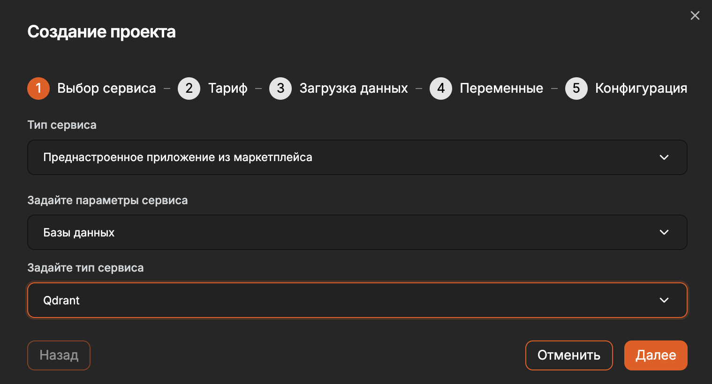
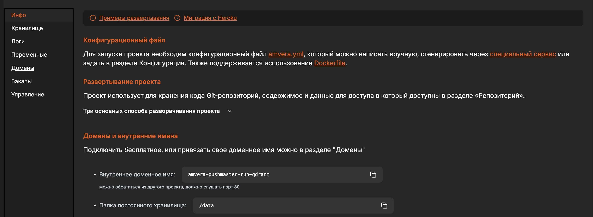

# Qdrant¶

## Содержание

- Qdrant
- Запуск Qdrant
  - 1. Создать проект
  - 2. Нажать «Завершить»
  - 3. Аутентификация
- Пример

---

Back to top

[ View this page ](<../_sources/databases/Qdrant.md.txt> "View this page")

Toggle Light / Dark / Auto color theme

Toggle table of contents sidebar

__

# Qdrant

## Запуск Qdrant

### 1\. Создать проект

Выбираем:
* Тип: Преднастроенное приложение из маркетплейса
* Параметры сервиса: Базы данных
* Тип сервиса: Qdrant



### 2\. Нажать «Завершить»

### 3\. Аутентификация

Qdrant поддерживает простую форму аутентификации клиента с помощью статического ключа API. Это можно использовать для защиты вашего экземпляра.

Чтобы включить аутентификацию на основе ключа API, необходимо создать переменную окружения: QDRANT__SERVICE__API_KEY содержащую произвольный набор символов

## Пример

Для подлючения из других проектов, развёрнутых в Amvera, воспользуйтесь Внутреннем доменным именем


[code] 
    ```
    from qdrant_client import QdrantClient
    # Подключение
    client = QdrantClient(
        url="http://amvera-pushmaster-run-qdrant-test:6333", #указать доменное и
        api_key="your_secret_api_key_here", # при наличии
    )
    
    ```
    
[/code]

[ Next n8n ](../marketplace/n8n.md) [ Previous Memcached ](memcached.md)

Copyright © 2024, Amvera 

Made with [Sphinx](<https://www.sphinx-doc.org/>) and [@pradyunsg](<https://pradyunsg.me>)'s [Furo](<https://github.com/pradyunsg/furo>)


---

### Навигация

← [Memcached](memcached.md)

→ [n8n](marketplace/n8n.md)
