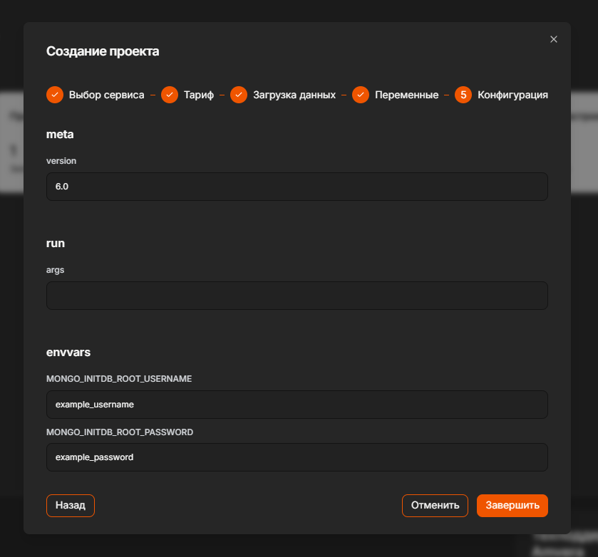
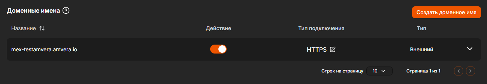

# MongoDB¶

## Содержание

- MongoDB
- Разворачивание СУБД
  - 1. Создать проект.
  - 2. На этапе «Конфигурация» настроить переменные окружения (envvars)
- Подключение к БД
- Развертывание mongo-express
  - 1. Создать проект.
  - 2. Указать необходимые параметры окружения.
  - 3. В разделе «Настройки» приложения активируембесплатное доменное имяилидобавляем свое.
- Видеопример как использовать MongoDB и Mongo Express в Amvera Cloud

---

Back to top

[ View this page ](<../_sources/databases/mongodb.md.txt> "View this page")

Toggle Light / Dark / Auto color theme

Toggle table of contents sidebar

__

# MongoDB

При развертывании используется образ Docker ``mongo:${meta.toolchain.version}``. Параметр ``meta.toolchain.version`` необязательный. Если его не указать, будет использоваться последний образ ``mongo:latest``.

Так как значение параметра ``meta.toolchain.version`` является тегом образа mongo, можно в качестве его значения использовать произвольный тег из [докер хаба](<https://hub.docker.com/_/mongo/tags>).

## Разворачивание СУБД

Для развертывания СУБД MongoDB вам потребуется выполнить следующие шаги:

### 1\. Создать проект.

Выбираем:
* Тип: Преднастроенное приложение из маркетплейса
* Параметры сервиса: Базы данных
* Тип сервиса: MongoDB

Вводим произвольное название проекта и выбирает подходящий тариф.

> **ATTENTION** > > Внимание Стабильная работа возможна на тарифах не ниже «Начальный». 

### 2\. На этапе «Конфигурация» настроить переменные окружения (envvars)

В разделе «Переменные» у проекта необходимо задать следующие [переменные окружения](../applications/configuration/variables.md):
* Для добавления имени пользователя необходимо нажать на кнопку «Создать переменную». В поле «Название» указать ``MONGO_INITDB_ROOT_USERNAME``, а в поле значение вписать желаемое имя пользователя.
* Для добавления пароля и безопасного его хранения требуется нажать на кнопку «Создать секрет». В поле «Название» указать ``MONGO_INITDB_ROOT_PASSWORD``, а в поле значение вписать желаемый пароль.

> **⚠️ Предупреждение** > > Важно Придумать достаточно сложный пароль для базы данных, чтобы злоумышленники не смогли получить к ней доступ. 

При необходимости, можно задать и другие поддерживаемые образом параметры. Более подробно об этих параметрах можно узнать на [странице образа](<https://hub.docker.com/_/mongo>).

> **⚠️ Предупреждение** > > Важно Стабильная работа с MongoDB проверена только с версиями 5.0 и 6.0 

## Подключение к БД

> **ATTENTION** > > Внимание Подключение к базе данных возможно только из других проектов, созданных в Amvera. 

Для подключения к базе данных необходимо использовать ``27017`` порт и внутреннее доменное имя, указанное на странице «Инфо» в формате:

``amvera-<имя-пользователя>-run-<транслитерированное-имя-проекта>``

## Развертывание mongo-express

Порядок действий совпадает с развертыванием самой СУБД:

### 1\. Создать проект.

Выбираем:
* Тип: Преднастроенное приложение из маркетплейса
* Параметры сервиса: Утилиты для баз данных
* Тип сервиса: Mongo-Express

Вводим произвольное название проекта и выбирает подходящий тариф.

> **ATTENTION** > > Внимание Как и в случае с MongoDB, стабильная работа возможна на тарифах не ниже «Начальный». 

### 2\. Указать необходимые параметры окружения.

В разделе «Переменные» у проекта необходимо задать следующие [переменные окружения](../applications/configuration/variables.md):
* Переменная ``ME_CONFIG_BASICAUTH_USERNAME`` \- имя пользователя администратора mongo-express
* Секрет ``ME_CONFIG_BASICAUTH_PASSWORD`` \- пароль для доступа к mongo-express (не имеет ничего общего с паролем от БД)
* ``ME_CONFIG_MONGODB_AUTH_USERNAME`` \- имя пользователя mongodb (то, что указывалось в переменной ``MONGO_INITDB_ROOT_USERNAME``)
* Секрет ``ME_CONFIG_MONGODB_AUTH_PASSWORD`` \- пароль для доступа к mongodb (то, что указывалось в секрете ``MONGO_INITDB_ROOT_PASSWORD``)
* Переменная ``ME_CONFIG_MONGODB_SERVER`` \- внутреннее доменное имя проекта с mongodb

### 3\. В разделе «Настройки» приложения активируем [бесплатное доменное имя](../applications/configuration/network.md#бесплатное-доменное-имя-амвера) или [добавляем свое](../applications/configuration/network.md#свое-доменное-имя).

> **HINT** > > Хитрость Чтобы экономить на потреблении проекта с mongo-express рекомендуем ставить его на паузу после окончания работы. 

## Видеопример как использовать MongoDB и Mongo Express в Amvera Cloud

Видео в VK Video для просмотра без VPN доступно по [ссылке](<https://vkvideo.ru/video-167699755_456239033>).

Видео в YouTube:

В этом видео мы рассмотрим, как использовать базу данных MongoDB в Amvera Cloud:
* Как развернуть базу данных MongoDB
* Как подключаться к базе данных MongoDB из других приложений
* Как использовать Mongo Express для управления базами данных MongoDB

Как развернуть приложение в Amvera Cloud: https://docs.amvera.ru/applications/quick-start.html Примеры деплоя в Amvera Cloud: https://docs.amvera.ru/general/examples.html

Таймкоды:
* 00:00 Интро
* 00:33 Развертывание MongoDB
* 01:17 Развертывание Mongo Express
* 03:03 Подключение к БД из другого проекта
* 05:15 Проверка работоспособности

[ Next MySQL ](mysql.md) [ Previous SQLite ](sqlite.md)

Copyright © 2024, Amvera 

Made with [Sphinx](<https://www.sphinx-doc.org/>) and [@pradyunsg](<https://pradyunsg.me>)'s [Furo](<https://github.com/pradyunsg/furo>)

---

### Навигация

← [SQLite](sqlite.md)

→ [MySQL](mysql.md)
