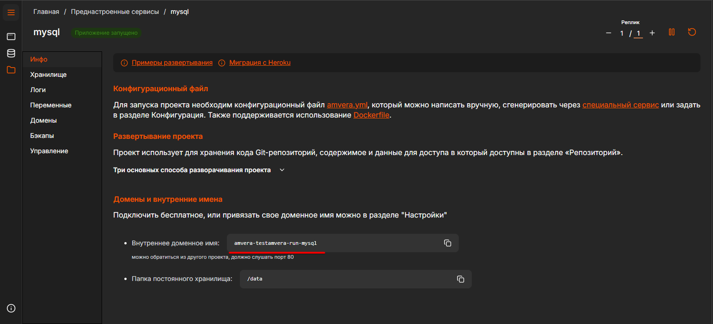
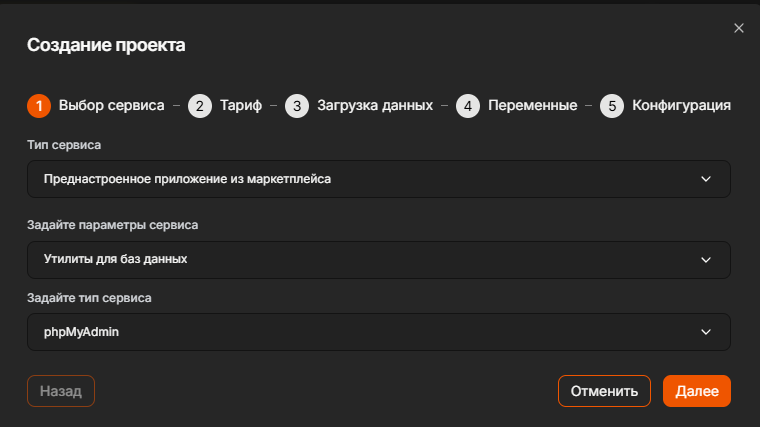
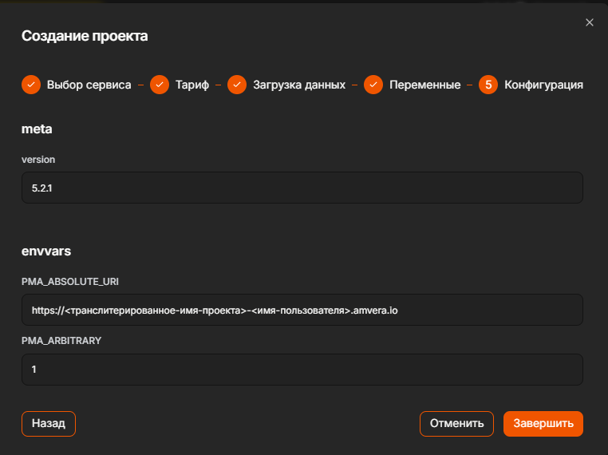
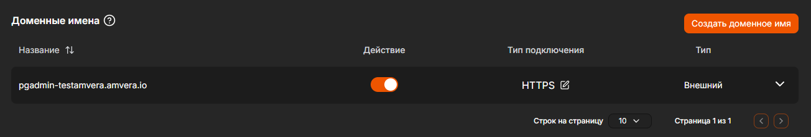
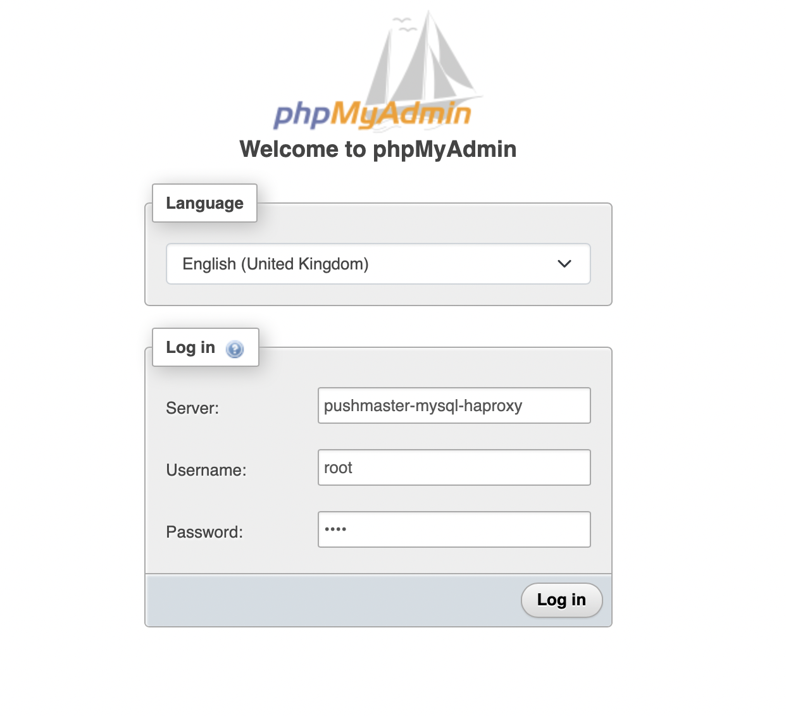
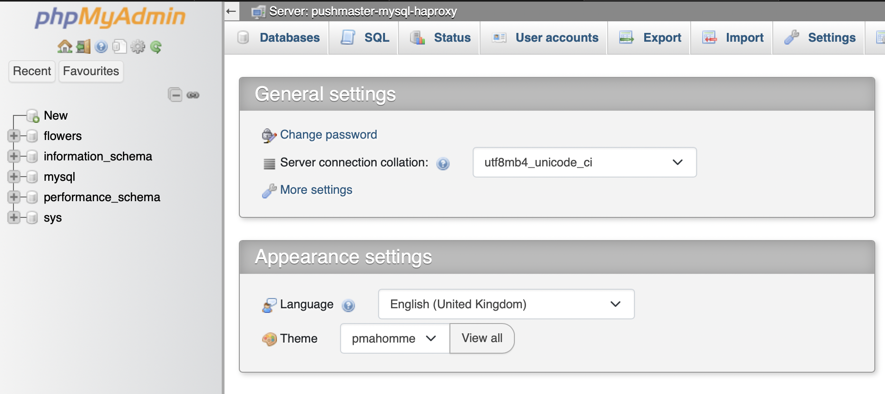

# MySQL¶

## Содержание

- MySQL
- Разворачивание кластера
- Добавление БД
- Подключение к кластеру
- Развертывание phpMyAdmin
  - 1. Создать приложение с подходящим тарифом.
  - 2. Указать необходимые переменные окружения.
  - 3. Активировать в настройкахбесплатное доменное имяилидобавляем свое.
  - 4. Подключиться к кластеру MySQL
- Видеопример как использовать MySQL и phpMyAdmin в Amvera Cloud

---

Back to top

[ View this page ](<../_sources/databases/mysql.md.txt> "View this page")

Toggle Light / Dark / Auto color theme

Toggle table of contents sidebar

__

# MySQL

## Разворачивание кластера
1. На главной странице нажать на кнопку «Создать».
2. Выбрать тип сервиса «Преднастроенное приложение из маркетплейса».
3. Выбрать параметр сервиса «Базы данных» и сервис «MySQL».
4. Ввести произвольное название проекта и выбрать подходящий тариф.

> **ATTENTION** > > Внимание Работа возможна на тарифе не ниже «Начальный». Если Вам требуется создание бэкапов, то необходимо повысить тариф до «Начальный Плюс» 
5. Задать параметры СУБД MySQL
* ``MYSQL_DATABASE`` \- имя создаваемой базы данных.
* ``MYSQL_ROOT_PASSWORD`` \- пароль для root пользователя.

> **⚠️ Предупреждение** > > Важно Это пароль для пользователя root, который будеть иметь доступ ко всем БД и права на любые действия. Пароль необходимо запомнить, его будет невозможно восстановить или изменить. 
* ``MYSQL_USER`` \- имя создаваемого пользователя MySQL.
* ``MYSQL_PASSWORD`` \- пароль для вышеуказанного пользователя.

> **⚠️ Предупреждение** > > Важно Тарификация происходит отдельно за каждую реплику согласно выбранному тарифу 
6. Нажать кнопку «Завершить» и дождаться перехода кластера в статус «Приложение запущено».

## Добавление БД

После создания кластера по дефолту будет создана БД «mysql» или та, что была указана в параметре ``MYSQL_DATABASE``, которая доступна для полноценной работы.

> **⚠️ Предупреждение** > > Важно Имя БД может состоять только из [A-Z], [a-z], [0-9], «_» и «-» 

## Подключение к кластеру

> **ATTENTION** > > Внимание Подключение к базе данных возможно только из других проектов, созданных в Amvera. 

Для доступа к базе данных из других проектов Амвера необходимо указать доменное имя, которое находится на вкладке «Инфо».

## Развертывание phpMyAdmin

### 1\. Создать приложение с подходящим тарифом.
1. На главной странице выбираем «Преднастроенные сервисы»
2. Нажимаем кнопку «Создать преднастроенный сервис» и задаем «Утилиты для баз данных» как параметры сервиса и «phpMyAdmin» как тип сервиса.
3. Жмем далее и вводим произвольное название проекта

> **ATTENTION** > > Внимание Для работы phpMyAdmin требуется выбрать тариф «Начальный». 

### 2\. Указать необходимые переменные окружения.

В разделе «Переменные» у проекта необходимо задать следующие [переменные окружения](../applications/configuration/variables.md):
* Переменная ``PMA_ABSOLUTE_URI`` \- ссылка на приложение (в формате ``https://<транслитерированное-имя-проекта>-<имя-пользователя>.amvera.io``)
* Переменная ``PMA_ARBITRARY``, установленная в 1

### 3\. Активировать в настройках [бесплатное доменное имя](../applications/configuration/network.md#бесплатное-доменное-имя-амвера) или [добавляем свое](../applications/configuration/network.md#свое-доменное-имя).

> **HINT** > > Хитрость Чтобы экономить на потреблении проекта с phpMyAdmin рекомендуем ставить его на паузу после окончания работы. 

### 4\. Подключиться к кластеру MySQL

* введите внутренне доменное имя
* имя пользователя (по дефолту создается пользователь ``root``)
* пароль пользователя (для ``root`` пользователя Вы устанавливали пароль при создании кластера)

> **⚠️ Предупреждение** > > Важно Доступ ко всем базам данных имеет только пользователь root. Вы можете зайти под иным созданным пользователем, тогда будет открыт доступ только к той бд, в которой он был создан. 

## Видеопример как использовать MySQL и phpMyAdmin в Amvera Cloud

Видео в VK Video для просмотра без VPN доступно по [ссылке](<https://vkvideo.ru/video-167699755_456239032>).

Видео в YouTube:

В этом видео мы рассмотрим, как использовать базу данных MySQL в Amvera Cloud:
* Как развернуть базу данных MySQL
* Как подключаться к базе данных MySQL из других приложений
* Как использовать phpMyAdmin для управления базами данных MySQL

Таймкоды:
* 00:00 Интро
* 00:34 Развертывание MySQL
* 01:28 Развертывание phpMyAdmin
* 02:47 Подключение к БД из другого проекта
* 05:04 Проверка работоспособности

[ Next Redis ](redis.md) [ Previous MongoDB ](mongodb.md)

Copyright © 2024, Amvera 

Made with [Sphinx](<https://www.sphinx-doc.org/>) and [@pradyunsg](<https://pradyunsg.me>)'s [Furo](<https://github.com/pradyunsg/furo>)

---

### Навигация

← [MongoDB](mongodb.md)

→ [Redis](redis.md)
