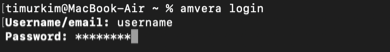
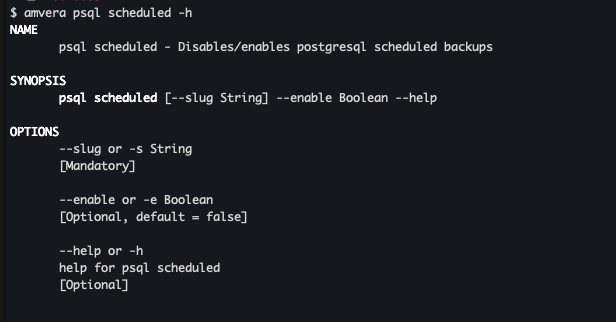

# CLI. Управление через командную строку¶

## Содержание

- CLI. Управление через командную строку
- Установка
- Обновления
- Пример использования

---

Back to top

[ View this page ](<../_sources/general/cli.md.txt> "View this page")

Toggle Light / Dark / Auto color theme

Toggle table of contents sidebar

__

# CLI. Управление через командную строку

Для упрощения взаимодействия с системой, нами разработан инструмент командной строки. CLI позволяет управлять всеми сервисами Amvera не покидая консоли.

## Установка

> **⚠️ Предупреждение** > > Важно Если версия amvera version вашего приложения ниже 1.0.0, перед установкой удалите старую версию. 

Команда для установки:
[code] 
    ```
    curl -sSL https://raw.githubusercontent.com/amvera-cloud/cli/master/amvera-install.sh | bash -s -- v1.0.5
    
    ```
    
[/code]

Windows

Для установки вам потребуется терминал с поддержкой bash, например, [Git bash](<https://git-scm.com/downloads/win>)

Автообновление или обновление по команде ``amvera update`` необходимо вызвать этого терминала.

  

После установки введите в командной строке: amvera -v (или amvera version)

Если все верно, cистема выведет примерно следующее


## Обновления

Проверка обновлений осуществляется один раз в день с вызовом любой команды. Если вы случайно отказались от обновления до новой версии, то обновиться можно командой ``amvera update``

Чтобы отключить автообновление - ``amvera update disabled``

Чтобы включить автообновление - ``amvera update enabled``

## Пример использования

Введите
[code] 
    ```
    amvera help 
    
    ```
    
[/code]

Вы получите список доступных команд (недоступные команды отмечены *).

После авторизации все команды будут доступны.

Пример вывода списка доступных команд 

Для начала работы с Amvera Сloud вам нужно войти под своим именем и паролем.

Введите
[code] 
    ```
    amvera login
    
    ```
    
[/code]



Внимание

Если вы не пользовались cli в течении 24 часов, то перед следующей командой вам придется ввести логин и пароль заново.

Посмотреть описание и пример использования команды, можно подставив флаг -h, например
[code] 
    ```
    amvera login -h
    
    ```
    
[/code]


Если требуется Boolean значение, то достаточно просто указать флаг


[code] 
    ```
    amvera psql scheduled enabled -s test -e
    
    ```
    
[/code]

Так же валидны:
[code] 
    ```
    amvera psql scheduled enabled -s test true
    amvera psql scheduled enabled -s test -e true
    amvera psql scheduled enabled -s test -e=true
    
    ```
    
[/code]

Если значение состоит из двух слов, то их нужно заключить в кавычки.

> **⚠️ Предупреждение** > > Важно CLI работает в BETA-версии. Могут наблюдаться ошибки работы CLI-утилиты. Будем благодарны, если напишете о них нам в support@amvera.ru. 

**Удаление**

Если вы устанавливали cli с помощью пакетного менеджера homebrew, то удаление происходит с помощью команды
[code] 
    ```
    brew rm amvera
    
    ```
    
[/code]

Скрипт удаления с помощью curl будет добавлен дополнительно.

В настоящий момент можете удалить файл, находящийся в ``which amvera`` для Unix систем или в Program Files для Windows.

[ Next SLA ](sla.md) [ Previous Поддержка проб Kubernetes ](k8sprobe.md)

Copyright © 2024, Amvera 

Made with [Sphinx](<https://www.sphinx-doc.org/>) and [@pradyunsg](<https://pradyunsg.me>)'s [Furo](<https://github.com/pradyunsg/furo>)


---

### Навигация

← [Поддержка проб Kubernetes](k8sprobe.md)

→ [SLA](sla.md)
