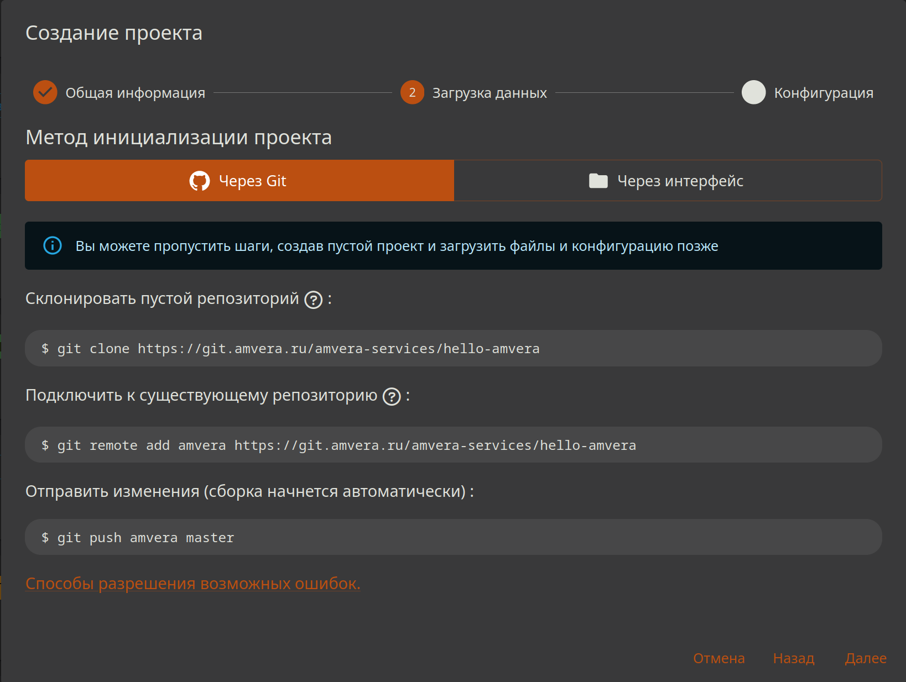

# Backend с использованием Flask¶

## Содержание

- Backend с использованием Flask
- Видеопример - Деплой Flask приложения с базой данных PostgreSQL
- Планирование
- Реализация
- Подготовка приложения для Amvera
- Создание проекта в Amvera
- Проверка работоспособности
- Если у вас не получается развернуть проект

---

Back to top

[ View this page ](<../../_sources/general/examples/python-flask.md.txt> "View this page")

Toggle Light / Dark / Auto color theme

Toggle table of contents sidebar

__

# Backend с использованием Flask

Инстукция содержит туториал и видеопример развертывания Flask приложения.

## Видеопример - Деплой Flask приложения с базой данных PostgreSQL

Содержание видео  Таймкоды: 
* 00:00 Intro
* 00:20 Развертывание БД
* 01:00 Подключение к БД
* 02:02 Развертывание сайта
* 02:27 requirements.txt
* 03:00 amvera.yml
* 03:48 Загрузка файлов
* 04:24 Переменные окружения
* 05:24 Постоянное хранилище /data
* 05:42 Подключение через Git

Видео в VK Video для просмотра без VPN доступно по [ссылке](<https://vkvideo.ru/video-167699755_456239048>).

Видео в YouTube:

## Планирование

Создадим простое приложение на языке программирования Python с использованием фреймворка Flask. Это будет API для TODO-заметок.

> **HINT** > > Подсказка Для ознакомления с принципом работы с git рекомендуем эту статью, которая позволит понять, как создавать git-репозиторий и вносить в него изменения. 

Каждая заметка будет определяться следующим образом:
[code] 
    ```
    {
      "text": "Купить молоко",
      "done": true
    }
    
    ```
    
[/code]

Все заметки будут храниться массивом в файле формата JSON.

Определим API следующим образом.
* ``GET /todo`` получает список всех TODO.
* ``GET /todo/<id>`` получает TODO с заданным id (индексом в массиве).
* ``POST /todo`` добавляет новую TODO в конец списка.
* ``PUT /todo/<id>`` заменяет TODO с заданным id.

## Реализация

Для начала напишем само приложение.

Так как наше приложение использует Flask, создадим файл ``requirements.txt``:
[code] 
    ```
    Flask==2.2.2
    Flask-CORS==3.0.10
    gunicorn==20.1.0
    
    ```
    
[/code]

Напишем код приложения, работающий локально, в файле ``app.py``:
[code] 
    ```
    import json
    from flask import Flask, request, abort
    from flask_cors import CORS
    
    FILENAME = "todo.json"
    
    def get_data():
        try:
            with open(FILENAME, "r", encoding="utf-8") as f:
                return json.load(f)
        except FileNotFoundError:
            return []
    
    def save_data(data):
        with open(FILENAME, "w", encoding="utf-8") as f:
            json.dump(data, f)
    
    app = Flask(__name__)
    cors = CORS(app)
    
    @app.route("/")
    def index():
        return "TODO App"
    
    @app.route("/todo")
    def get_all_todo():
        return get_data()
    
    @app.route("/todo/<int:id>")
    def get_single_todo(id):
        data = get_data()
        if id < 0 or id >= len(data):
            abort(404)
        return data[id]
    
    @app.route("/todo", methods=["POST"])
    def add_new_todo():
        new_todo = request.json
        if new_todo is None:
            abort(400)
        data = get_data()
        data.append(new_todo)
        save_data(data)
        return "OK", 201
        
    @app.route("/todo/<int:id>", methods=["PUT"])
    def update_todo(id):
        data = get_data()
        if id < 0 or id >= len(data):
            abort(404)
        updated_todo = request.json
        if updated_todo is None:
            abort(400)
        data[id] = updated_todo
        save_data(data)
        return "OK"
    
    if __name__ == "__main__":
        app.run(port=8080)
    
    ```
    
[/code]

Установим зависимости:
[code] 
    ```
    pip install -r requirements.txt
    
    ```
    
[/code]

Запустим приложение:
[code] 
    ```
    python app.py
    
    ```
    
[/code]

Убедимся в его работоспособности при помощи Postman.

## Подготовка приложения для Amvera

Подготовим приложение для окружения Amvera. Напишем ``amvera.yaml``.

Написать yaml файл можно как самостоятельно, используя инструкцию ниже, так и воспользоваться нашим генератором yaml, перейдя по [ссылке](<https://manifest.amvera.ru/>).
[code] 
    ```
    meta:
      environment: python
      toolchain:
        name: pip
    
    run:
      command: gunicorn --bind 0.0.0.0:5000 app:app
      containerPort: 5000
    
    ```
    
[/code]

Так как для развертывания нашего приложения мы используем gunicorn, добавим его в ``requirements.txt``:
[code] 
    ```
    Flask==2.2.2
    Flask-CORS==3.0.10
    gunicorn==20.1.0
    
    ```
    
[/code]

Осталось решить проблему с сохранением файла с TODO в /data.

Добавим ``import os`` в начало файла ``app.py``, а также изменим объявление переменной ``FILENAME``:
[code] 
    ```
    FILENAME = "/data/todo.json" if "AMVERA" in os.environ else "todo.json"
    
    ```
    
[/code]

Теперь начало файла ``app.py`` выглядит так:
[code] 
    ```
    import os
    import json
    from flask import Flask, request, abort
    from flask_cors import CORS
    
    FILENAME = "/data/todo.json" if "AMVERA" in os.environ else "todo.json"
    
    def get_data():
    # ... остаток файла
    
    ```
    
[/code]

Инициализируем репозиторий git:
[code] 
    ```
    git init
    
    ```
    
[/code]

Добавим созданные нами файлы в индекс:
[code] 
    ```
    git add app.py requirements.txt amvera.yml
    
    ```
    
[/code]

Зафиксируем изменения:
[code] 
    ```
    git commit -m "TODO App"
    
    ```
    
[/code]

## Создание проекта в Amvera

Теперь нужно создать приложение в Amvera. Откроем страницу <https://cloud.amvera.ru/projects> и нажмите кнопку «Создать».

В процессе создания приложение, возьмем данные для git репозитория на этапе «Загрузка данных». Так же их можно найти во вкладке «Репозиторий» самого приложения.
[code] 
    ```
    git remote add amvera https://git.amvera.ru/<имя-пользователя>/todo-app
    git push amvera master
    
    ```
    
[/code]



После этого начнется [сборка](../../applications/build.md) и [развертывание](../../applications/run.md) приложения. Дождитесь появления статуса «Успешно развернуто».

## Проверка работоспособности

Снова воспользуемся Postman для отправки запросов.

Для проверки сохранности данных после перезагрузки, перезапустим сервис кнопкой в интерфейсе.

После завершения перезапуска отправим запрос Постманом для проверки наличия TODO заметок. Если они есть, значит мы все сделали правильно.

Если что-то не работает, рекомендуем ознакомиться с логами Сборки и Приложения.

> **HINT** > > Подсказка Если логи пишутся в print, для их отображения надо выставить переменную окружения PYTHONUNBUFFERED в 1. 

> **⚠️ Предупреждение** > > Важно Сохраняйте файлы БД и иные изменяемые данные в постоянное хранилище, чтобы избежать их потери при обновлении проекта, когда производится «откат» папки код до состояния обновления репозитория. Папка data в корне проекта и директория /data, это разные директории. Проверить, что сохранение идет в /data, можно зайдя в папку «data» на странице «Репозиторий». 

> **⚠️ Предупреждение** > > Важно Чтобы избежать ошибки 502, измените в вашем коде host 127.0.0.1 (или подобный localhost) на 0.0.0.0, и пропишите в конфигурации порт, который слушает ваше приложение (пример - 8080). 

Поздравляем, вы успешно создали свое первое приложение в Amvera!

## Если у вас не получается развернуть проект

Напишите наблюдаемую вами симптоматику на support@amvera.ru с указанием вашего имени пользователя и названия проекта, мы постараемся вам помочь.

[ Next Телеграм бот на Python ](python-tgbot.md) [ Previous Примеры ](../examples.md)

Copyright © 2024, Amvera 

Made with [Sphinx](<https://www.sphinx-doc.org/>) and [@pradyunsg](<https://pradyunsg.me>)'s [Furo](<https://github.com/pradyunsg/furo>)


---

### Навигация

← [Примеры](examples.md)

→ [Телеграм бот на Python](python-tgbot.md)
