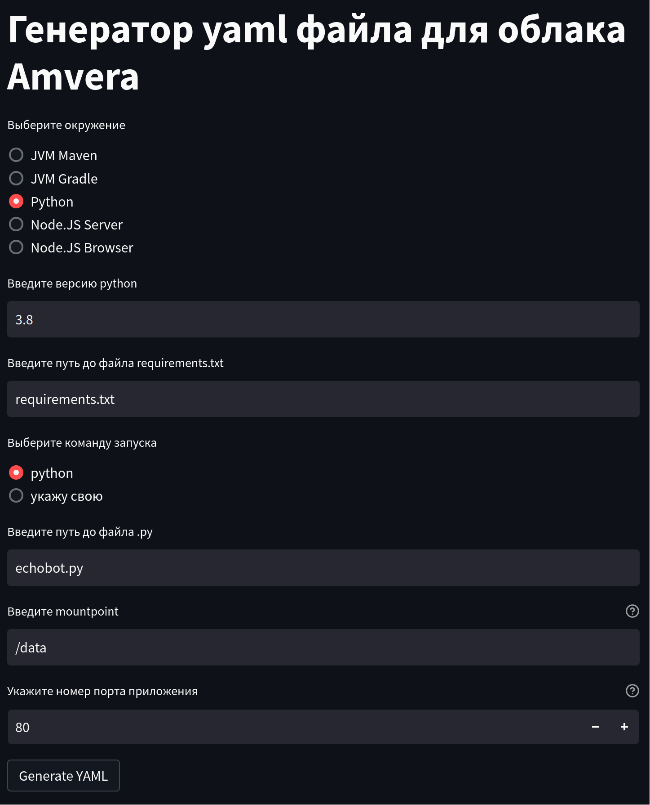

# Телеграм бот на Python¶

## Содержание

- Телеграм бот на Python
- Видеопример №1
- Видеопример №2
- Инструкция с загрузкой через push в git
  - Предварительная подготовка
  - Создание YAML файла
  - Создание файла с зависимостями
  - Привязка git-репозитория и push в master
  - Развертывание приложения
- Если у вас не получается развернуть проект

---

Back to top

[ View this page ](<../../_sources/general/examples/python-tgbot.md.txt> "View this page")

Toggle Light / Dark / Auto color theme

Toggle table of contents sidebar

__

# Телеграм бот на Python

В этой статье мы рассмотрим, как развернуть телеграм бота на python.

Статья содержит текстовую инструкцию и несколько видеопримеров на ее основе.

## Видеопример №1

Загрузка через Git (и интерфейс) c базой данных SQlite

Содержание видео  Таймкоды: \- 00:00 - Про проект \- 02:25 - Создание файла requirements.txt \- 03:00 - Загрузка через интерфейс \- 03:30 - Задание конфигурации \- 04:35 - Загрузка SQLite \- 05:30 - Загрузка через Git \- 06:45 - Генерация конфигурационного файла amvera.yml через сервис генерации \- 09:25 - Генерация конфигурационного файла amvera.yml через интерфейс и выполнение git pull 

Видео в VK Video для просмотра без VPN доступно по [ссылке](<https://vkvideo.ru/video-167699755_456239041>).

Видео в YouTube:

## Видеопример №2

Загрузка через интерфейс

Видео в VK Video для просмотра без VPN доступно по [ссылке](<https://vkvideo.ru/video-167699755_456239043>).

Видео в YouTube:

## Инструкция с загрузкой через push в git

Возьмем готовый пример [эхо бота](<https://github.com/python-telegram-bot/python-telegram-bot/blob/master/examples/echobot.py>) от создателя библиотеки для работы с телеграмом python-telegram-bot.

> **HINT** > > Подсказка Для ознакомления с принципом работы с git рекомендуем эту статью, которая позволит понять, как создавать git-репозиторий и вносить в него изменения. 

### Предварительная подготовка
* В телеграме через поиск найти бот «BotFather» и запросить у него создание нового телеграм бота. Он попросит ввести название и username для бота, после чего выдаст токен.
* Скопировать выданный токен и вставить его в файл примера эхо бота на место слова TOKEN в функции main()
* Написать YAML файл или Dockerfile. Для yaml у нас есть генератор, поддерживающий ограниченный набор окружений, в остальных случаях рекомендуется использовать [Dockerfile](<https://docs.amvera.ru/books/amvera/page/docker>). Но в данном примере вам подойдет [генератор yaml](<https://manifest.amvera.ru/>).
* Создать файл с зависимостями requirements.txt
* Привязать репозиторий к Amvera
* Сделать push в master

### Создание YAML файла

Подробно о том, как вручную составить файл конфигурации описано в [документации](../../applications/configuration/config-file.md). Мы же воспользуемся [автоматическим графическим инструментом генерации](<https://manifest.amvera.ru/>).


* Выбираем окружение Python и версию.
* Указываем версию и путь до файла requirements.txt. Очень важно указать все используемые в проекте пакеты в этом файле, чтобы облако смогло их скачать через pip.
* Указываем путь до файла, содержащего точку входа в программу (тот файл, который вы указываете интерпретатору питона, когда запускаете приложение). В нашем случае это файл echobot.py (если ваш файл находится не в корневой папке проекта, то нужно указывать путь относительно корня проекта. Если бы мой файл был в папке src, мы бы указали в этом поле src/echobot.py)
* Если в процессе работы ваш бот собирает какие-то данные от пользователя, которые следует сохранять на диск, то их следует класть в папку data. В противном случае при перезапуске проекта все данные будут потеряны!
* Порт можно указать любой, так как в нашем случае он не играет никакой роли (но в большинстве случаев мы рекомендуем использовать порт 80, именно он открыт в Amvera).
* Нажимаем на кнопку Generate YAML, после чего начинается загрузка файла amvera.yml.
* Скачанный файл кладем в корень нашего проекта.

### Создание файла с зависимостями
* Cоздать файл ``requirements.txt`` , в котором прописать строчку: ``python-telegram-bot``

> **ATTENTION** > > Внимание В вашем проекте могут быть другие зависимости, отличающиеся от зависимостей в этом примере - их все нужно корректно прописать. 

> **HINT** > > Подсказка При развертывании телеграм-ботов частой ошибкой является неверное название «телебота» в requirements.txt. Телебот в requirements.txt должен называться pyTelegramBotAPI, а не telebot. 
* Вызвать ``pip install -r requirements.txt``, чтобы установить этот пакет. Почему бы просто не установить пакет через ``pip install python-telegram-bot``? Так тоже можно, но файл requirements.txt все равно понадобится для разворачивания в облаке, поэтому лучше сразу его создать.
* Проверить, что все работает, можно запустив бот локально через python3 echobot.py и протестировав созданный бот в телеграм (ссылку на бот можно найти у BotFather).
* Поместить ваш ``requirements.txt`` в корень репозитория.

### Привязка git-репозитория и push в master

Возможно два варианта:
1. Привязать к уже имеющемуся репозиторию (папке).
* Инициализировать git репозиторий. Как установить [git](../../applications/git.md), если он ещё не установлен, описано [тут](<https://git-scm.com/book/ru/v2/%D0%92%D0%B2%D0%B5%D0%B4%D0%B5%D0%BD%D0%B8%D0%B5-%D0%A3%D1%81%D1%82%D0%B0%D0%BD%D0%BE%D0%B2%D0%BA%D0%B0-Git>).
* В корне нашего проекта даем команду: ``git init`` (если гит уже инициализирован в вашем проекте, то этого делать не нужно)
* Привязываем наш локальный гит репозиторий к удаленному репозиторию через команду, которая указана на странице проекта в amvera:
[code] ```
           git remote add amvera https://git.amvera.ru/<имя-пользователя>/<транслитерированное-имя-проекта>`
           
           ```
           
[/code]
* Проверяем, что все изменения закомичены, вызывая ``git status``. Если там будет список файлов, то значит нужно их закомитить, выполнив:
[code] ```
           git add .
           git commit -m "Some informative msg"
           
           ```
           
[/code]
* Отправляем изменения в репозиторий Amvera
[code] ```
           git push amvera master
           
           ```
           
[/code]

На запрос пользователя и пароля укажите имя пользователя и пароль вашей учетной записи Amvera.
2. Использовать выделенный репозиторий Amvera (а не привязывать свой).
* Склонируем пустой репозиторий:
[code] ```
           git clone https://git.amvera.ru/<имя-пользователя>/<транслитерированное-имя-проекта>
           
           ```
           
[/code]
* Проверяем, что все изменения закомичены, вызывая ``git status``. Если там будет список файлов, то значит нужно их закомитить, выполнив:
[code] ```
           git add .
           git commit -m "Some informative msg"
           
           ```
           
[/code]
* Отправляем изменения в репозиторий Amvera
[code] ```
           git push amvera master
           
           ```
           
[/code]

На запрос пользователя и пароля укажите имя пользователя и пароль вашей учетной записи Amvera.

### Развертывание приложения

После того как проект запушится в систему, начнется [сборка](../../applications/build.md) и на странице проекта статус поменяется на «Выполняется сборка».

Как только проект соберется, он перейдет в стадию [запуска](../../applications/run.md) и статус сменится на «Выполняется развертывание», а после перейдет в «Успешно развернуто».

Если по какой-то причине проект не развернулся, можно обратиться к логам сборки и логам приложения для отладки (они могут идти с задержкой в 5-10 минут). Если Проект завис в статусе «Сборка» на долгое время, а логи сборки не отображаются, то стоит ещё раз проверить корректность ``amvera.yaml`` файла и ``requirements.txt`` файла.

> **HINT** > > Подсказка Если логи пишутся в print, для их отображения надо выставить переменную окружения PYTHONUNBUFFERED в 1. 

> **⚠️ Предупреждение** > > Важно Сохраняйте файлы БД и иные изменяемые данные в постоянное хранилище, чтобы избежать их потери при обновлении проекта, когда производится «откат» папки код до состояния обновления репозитория. Папка data в корне проекта и директория /data, это разные директории. Проверить, что сохранение идет в /data, можно зайдя в папку «data» на странице «Репозиторий». 

> **⚠️ Предупреждение** > > Важно Чтобы избежать ошибки 502, измените в вашем коде host 127.0.0.1 (или подобный localhost) на 0.0.0.0, и пропишите в конфигурации порт, который слушает ваше приложение (пример - 8080). 

## Если у вас не получается развернуть проект

Напишите наблюдаемую вами симптоматику на support@amvera.ru с указанием вашего имени пользователя и названия проекта, мы постараемся вам помочь.

[ Next Fullstack на Django ](python-django.md) [ Previous Backend с использованием Flask ](python-flask.md)

Copyright © 2024, Amvera 

Made with [Sphinx](<https://www.sphinx-doc.org/>) and [@pradyunsg](<https://pradyunsg.me>)'s [Furo](<https://github.com/pradyunsg/furo>)


---

### Навигация

← [Backend с использованием Flask](python-flask.md)

→ [Fullstack на Django](python-django.md)
