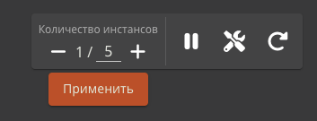

# Масштабирование ресурса¶

## Содержание

- Масштабирование ресурса
- Ситуации, требующие масштабирования
- Изменение количества реплик

---

Back to top

[ View this page ](<../_sources/general/scaling.md.txt> "View this page")

Toggle Light / Dark / Auto color theme

Toggle table of contents sidebar

__

# Масштабирование ресурса

Можно запускать несколько инстансов контейнера, одного ресурса (приложения или СУБД). Это может быть нужно для повышения отказоустойчивости проекта и распределения нагрузки между инстансами.

> **ATTENTION** > > Внимание Не каждый сайт, бот или веб-приложение может эффективно работать будучи запущенным в нескольких экземплярах. 

## Ситуации, требующие масштабирования

Приведем примеры того, как можно переработать приложение, чтобы поддерживать работу в нескольких экземплярах. Эти примеры упрощены и их стоит рассматривать только как отправную точку в проектировании масштабируемых приложений.

**Пример 1**. Телеграм бот работает в режиме опроса. Если запустить его в нескольких экземплярах, то каждый из них будет получать одни и те же события от телеграма. Следовательно, бот будет реагировать на событие столько раз, сколько инстансов его запущено. Это чаще всего является ошибкой и примером приложения, не поддерживающего горизонтальное масштабирование.

Что можно сделать? Можно переключить бота из режима опроса в режим веб-хуков. В этом случае не бот будет запрашивать события телеграма, а телеграм будет отправлять события боту. Эти события будет получать балансировщик нагрузки Amvera и распределять их по экземлпярам бота. Так бот будет реагировать только один раз на одно событие. Следовательно, ошибка будет устранена и приложение может поддерживать горизонтальное масштабирование.

**Пример 2**. Интернет-магазин хранит корзину пользователя в оперативной памяти. Если такой интернет-магазин запустить в двух экземплярах, часть запросов будет приходить в один экземпляр, а часть - во второй. Так, у пользователя может формироваться две разные корзины и между перезагрузками страницы пользователь будет видеть то одну, то другую. Это является ошибкой и примером приложения, не поддерживающего горизонтальное масштабирование.

Что можно сделать? Можно подключить базу данных (лучше всего) или хотя бы хранение корзины пользователя в файлах, доступных всем экземплярам приложения. В этом случае, в какой бы экземпляр интернет-магазина ни пришел бы запрос, работать он будет с одной и той же корзиной. Следовательно, ошибка будет устранена и приложение может поддерживать горизонтальное масштабирование.

## Изменение количества реплик

Когда вы убедились, что ваше приложение поддерживает горизонтальное масштабирование, вы можете увеличить количество экземпляров на странице проекта.

После того как Вы указали требуемое количество экземпляров, нажмите на кнопку «Применить»:

После масштабирования приложения отобразиться нужное количество инстансов. Если отображение не происходит, перезагрузите страницу браузера.

После нажатия на кнопку будут запущены дополнительные контейнеры (или остановлены лишние). На запуск и остановку контейнеров требуется время, поэтому текущее количество контейнеров изменится в течение нескольких минут.

Если выставить количество контейнеров в 0, то проект будет полностью остановлен (и за него не будут списываться средства).

[ Next Уведомления о сбоях ](notifications.md) [ Previous Смена тарифного плана ](tarifs.md)

Copyright © 2024, Amvera 

Made with [Sphinx](<https://www.sphinx-doc.org/>) and [@pradyunsg](<https://pradyunsg.me>)'s [Furo](<https://github.com/pradyunsg/furo>)

---

### Навигация

← [Смена тарифного плана](tarifs.md)

→ [Уведомления о сбоях](notifications.md)
